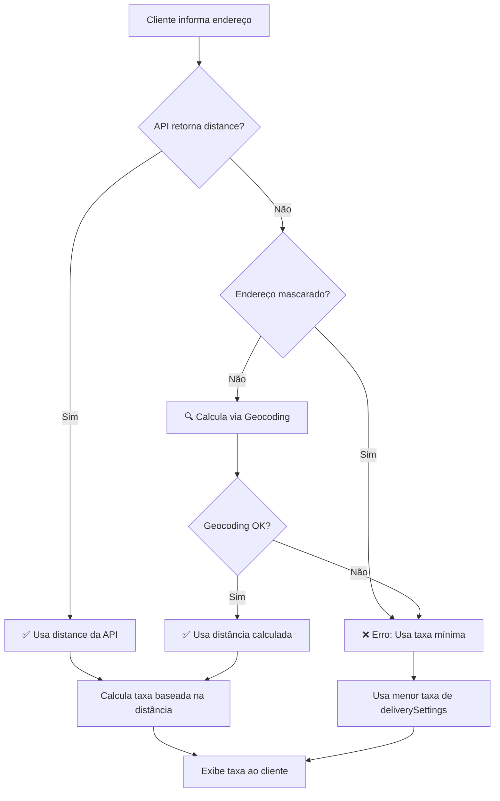

# 📍 Sistema de Cálculo de Distância para Taxa de Entrega

## Visão Geral

O sistema calcula automaticamente a taxa de entrega baseada na distância entre o restaurante e o cliente, usando **três estratégias prioritárias**.

---

## 🎯 Prioridade de Cálculo

### ✅ PRIORIDADE 1: Distância do Endereço do Customer (Novo!)

**Quando usar:** Cliente já cadastrado com endereço salvo.

**Endpoint:** `GET /customer/{phone}`

**Estrutura da API:**

```json
{
  "token": "eyJhbGciOiJIUzI1NiIsInR5cCI6IkpXVCJ9...",
  "customer": {
    "id": 7,
    "name": "Matheus s.",
    "phone": "(67)*****1768",
    "address": {
      "street": "RuaB.",
      "number": "1431",
      "neighborhood": "JardimP.",
      "postalCode": "**603-070",
      "complement": "",
      "distance": 3142
    }
  }
}
```

**Campo `address.distance`:**
- **Tipo:** `number`
- **Unidade:** Metros
- **Quando enviar:** Sempre que cliente já tiver endereço cadastrado
- **Exemplo:** `3142` = 3.14km
- **Vantagem:** Funciona mesmo com endereço mascarado

**Comportamento:**

```typescript
if (addressData.distance && addressData.distance > 0) {
  // ✅ Usa distância do endereço do customer
  const distanceInMeters = addressData.distance;
  const distanceInKm = distanceInMeters / 1000;
  const fee = calculateDeliveryFee(distanceInMeters, deliverySettings);
}
```

**Toast ao usuário:**
```
📍 Distância: 3.14km (do seu endereço salvo)
💰 Taxa de entrega: R$ 7.00
```

---

### ✅ PRIORIDADE 2: Distância do PickUpLocation

**Quando usar:** Endereços mascarados ou quando o backend já calculou a distância.

**Estrutura da API:**

```json
{
  "store": {
    "configs": {
      "settings": {
        "pickUpLocation": {
          "label": "Rua da Justiça, 2487 - Jardim Imperial",
          "mapsUrl": "https://maps.google.com/...",
          "distance": 2500
        },
        "deliverySettings": [
          { "distance": 0, "value": 5 },
          { "distance": 3001, "value": 7 },
          { "distance": 5001, "value": 10 }
        ]
      }
    }
  }
}
```

**Campo `distance`:**
- **Tipo:** `number`
- **Unidade:** Metros
- **Quando enviar:** Sempre que possível (especialmente se endereço do cliente estiver mascarado)
- **Exemplo:** `2500` = 2.5km

**Comportamento:**

```typescript
if (pickUpLocation.distance && pickUpLocation.distance > 0) {
  // ✅ Usa distância da API diretamente
  const distanceInMeters = pickUpLocation.distance;
  const distanceInKm = distanceInMeters / 1000;
  const fee = calculateDeliveryFee(distanceInMeters, deliverySettings);
}
```

**Vantagens:**
- ⚡ Cálculo instantâneo (sem chamadas externas)
- 🎯 Mais preciso (backend pode usar Google Maps API)
- 🔒 Funciona com endereços mascarados
- 💰 Sem custo de APIs de geocoding

**Toast ao usuário:**
```
📍 Distância: 2.50km (fornecida pela API)
💰 Taxa de entrega: R$ 7.00
```

---

### 🔄 PRIORIDADE 2: Geocoding (Fallback)

**Quando usar:** `distance` não existe ou é `0` na API.

**Requisitos:**
- Endereço do restaurante completo
- Endereço do cliente completo (sem máscaras)

**Comportamento:**

```typescript
if (!pickUpLocation.distance || pickUpLocation.distance === 0) {
  // 🔍 Calcula via geocoding
  const result = await calculateDistance(
    "Rua da Justiça, 2487, Jardim Imperial, Campo Grande, MS",
    "Rua Baronesa do Triunfo, 1431, Jardim Paulista, Campo Grande, MS"
  );
  
  const distanceInMeters = result.distanceInMeters;
  const fee = calculateDeliveryFee(distanceInMeters, deliverySettings);
}
```

**Tecnologia:**
- **API:** Nominatim (OpenStreetMap) - 100% gratuita
- **Cálculo:** Fórmula de Haversine
- **Rate Limit:** 1 requisição/segundo
- **Delay:** 1.1s entre geocodificação de origem e destino

**Toast ao usuário:**
```
✅ Distância calculada: 2.50km
💰 Taxa de entrega: R$ 7.00
```

---

## 📊 Fluxo Completo



---

## 💻 Implementação no Frontend

### Código no `CheckoutPage.tsx`

```typescript
const apiDistance = currentRestaurant?.settings?.pickUpLocation?.distance;

// PRIORIDADE 1: Distância da API
if (apiDistance && apiDistance > 0) {
  console.log('📍 Usando distância fornecida pela API:', apiDistance, 'metros');
  distanceInMeters = apiDistance;
  distanceInKm = Math.round((distanceInMeters / 1000) * 100) / 100;
  
  toast.info(`📍 Distância: ${distanceInKm.toFixed(2)}km (fornecida pela API)`);
} 
// PRIORIDADE 2: Geocoding
else {
  console.log('🔍 Calculando distância via geocoding...');
  const result = await calculateDistance(pickUpLocation, customerAddress);
  distanceInMeters = result.distanceInMeters;
  distanceInKm = result.distanceInKm;
  
  toast.success(`✅ Distância calculada: ${distanceInKm.toFixed(2)}km`);
}

// Calcular taxa
const fee = calculateDeliveryFee(distanceInMeters, deliverySettings);
```

---

## 🔧 Configuração do Backend

### Envio de Distância (Recomendado)

**Endpoint:** `GET /restaurant/:slug`

**Quando o cliente faz a requisição, o backend deve:**

1. **Pegar endereço do cliente** (do token/sessão ou query param)
2. **Calcular distância** usando Google Maps Distance Matrix API
3. **Incluir `distance` na resposta**

```typescript
// Exemplo Backend (Node.js)
async function getRestaurantConfig(slug: string, customerAddress?: string) {
  const restaurant = await Restaurant.findOne({ slug });
  
  let distance = null;
  
  // Se temos endereço do cliente, calcular distância
  if (customerAddress && restaurant.settings.pickUpLocation) {
    distance = await calculateDistanceUsingGoogleMaps(
      restaurant.settings.pickUpLocation.label,
      customerAddress
    );
  }
  
  return {
    store: {
      configs: {
        settings: {
          pickUpLocation: {
            label: restaurant.settings.pickUpLocation.label,
            mapsUrl: restaurant.settings.pickUpLocation.mapsUrl,
            distance: distance // em metros
          },
          deliverySettings: restaurant.settings.deliverySettings
        }
      }
    }
  };
}
```

### Google Maps Distance Matrix API

```typescript
async function calculateDistanceUsingGoogleMaps(
  origin: string,
  destination: string
): Promise<number> {
  const response = await axios.get(
    'https://maps.googleapis.com/maps/api/distancematrix/json',
    {
      params: {
        origins: origin,
        destinations: destination,
        key: process.env.GOOGLE_MAPS_API_KEY
      }
    }
  );
  
  const distanceInMeters = response.data.rows[0].elements[0].distance.value;
  return distanceInMeters;
}
```

---

## 🎭 Cenários de Uso

### Cenário 1: API Envia Distância (Ideal)

**Requisição:**
```http
GET /restaurant/meu-restaurante
```

**Resposta:**
```json
{
  "pickUpLocation": {
    "label": "Rua X, 123",
    "mapsUrl": "https://...",
    "distance": 3500
  }
}
```

**Resultado:**
- ✅ Sistema usa `3500` metros (3.5km)
- ✅ Calcula taxa: R$ 7.00 (faixa 3001-5000m)
- ✅ Exibe: "📍 Distância: 3.50km (fornecida pela API)"

---

### Cenário 2: API Não Envia Distância + Endereço Completo

**Requisição:**
```http
GET /restaurant/meu-restaurante
```

**Resposta:**
```json
{
  "pickUpLocation": {
    "label": "Rua da Justiça, 2487, Jardim Imperial, Campo Grande, MS",
    "mapsUrl": "https://..."
  }
}
```

**Endereço do Cliente:**
```
Rua Baronesa do Triunfo, 1431, Jardim Paulista, Campo Grande, MS
```

**Resultado:**
- 🔍 Sistema geocodifica ambos endereços
- 🧮 Calcula distância via Haversine: ~2.3km
- ✅ Calcula taxa: R$ 5.00 (faixa 0-3000m)
- ✅ Exibe: "✅ Distância calculada: 2.30km"

---

### Cenário 3: API Não Envia Distância + Endereço Mascarado

**Requisição:**
```http
GET /restaurant/meu-restaurante
```

**Resposta:**
```json
{
  "pickUpLocation": {
    "label": "Rua da Justiça, 2487",
    "mapsUrl": "https://..."
  }
}
```

**Endereço do Cliente:**
```
RuaB., 1431, **603-070
```

**Resultado:**
- ❌ Sistema detecta endereço mascarado
- ⚠️ Não tenta geocodificar
- 💰 Usa taxa mínima: R$ 5.00 (menor taxa de deliverySettings)
- ⚠️ Exibe: "⚠️ Endereço incompleto ou mascarado detectado. Sistema usando taxa mínima."

---

## 📋 Checklist de Implementação

### Backend (Recomendado)

- [ ] Integrar Google Maps Distance Matrix API
- [ ] Adicionar campo `distance` (metros) em `pickUpLocation`
- [ ] Calcular distância quando cliente faz requisição
- [ ] Retornar `distance` junto com configurações do restaurante
- [ ] Tratar erros de geocoding (fallback para `null`)

### Frontend (Já Implementado)

- [x] Verificar se `pickUpLocation.distance` existe
- [x] Usar distância da API como prioridade
- [x] Fallback para geocoding via Nominatim
- [x] Detectar endereços mascarados
- [x] Usar taxa mínima quando falhar
- [x] Exibir toasts informativos ao usuário

---

## 🧪 Testes

### Teste 1: Distância da API

```typescript
// Mock da resposta da API
const mockRestaurant = {
  settings: {
    pickUpLocation: {
      distance: 2500 // 2.5km
    },
    deliverySettings: [
      { distance: 0, value: 5 },
      { distance: 3001, value: 7 }
    ]
  }
};

// Resultado esperado
expect(deliveryFee).toBe(5); // Faixa 0-3000m = R$ 5.00
expect(toast).toContain("2.50km (fornecida pela API)");
```

### Teste 2: Geocoding com Endereço Completo

```typescript
// Mock sem distance
const mockRestaurant = {
  settings: {
    pickUpLocation: {
      label: "Rua X, 123, Bairro, Cidade, Estado"
      // sem distance
    }
  }
};

// Resultado esperado
expect(calculateDistance).toHaveBeenCalled();
expect(toast).toContain("Distância calculada");
```

### Teste 3: Endereço Mascarado

```typescript
const customerAddress = "Rua**, **, **603-070";

// Resultado esperado
expect(isAddressMasked(customerAddress)).toBe(true);
expect(deliveryFee).toBe(5); // Taxa mínima
expect(toast).toContain("mascarado detectado");
```

---

## 📈 Métricas de Monitoramento

### Logs Importantes

```typescript
// Distância da API
console.log('📍 Usando distância fornecida pela API:', distance, 'metros');

// Geocoding
console.log('🔍 Calculando distância via geocoding...');
console.log('✅ Distância calculada:', distanceInKm, 'km');

// Erro
console.error('❌ Erro ao processar distância:', error);
console.warn('⚠️ Endereço mascarado detectado:', address);
```

### Métricas Sugeridas

- **Taxa de Uso da API**: % de requisições onde `distance` vem da API
- **Taxa de Geocoding**: % de requisições que usam Nominatim
- **Taxa de Fallback**: % de requisições que usam taxa mínima
- **Tempo Médio**: Tempo entre início do cálculo e exibição da taxa

---

## 🚀 Recomendações

### Para Melhor Experiência

1. **✅ SEMPRE enviar `distance` da API** quando possível
2. **✅ Usar Google Maps Distance Matrix** no backend (mais preciso)
3. **✅ Cachear distâncias** para mesmos pares origem-destino
4. **✅ Enviar coordenadas** se disponível (alternativa ao address)

### Estrutura Completa Ideal

```json
{
  "pickUpLocation": {
    "label": "Rua da Justiça, 2487 - Jardim Imperial",
    "mapsUrl": "https://maps.google.com/...",
    "distance": 2500,
    "coordinates": {
      "latitude": -20.4697,
      "longitude": -54.6201
    }
  }
}
```

---

## 📞 Suporte

**Documentação relacionada:**
- `DELIVERY_FEE_DISTANCE.md` - Especificação completa do sistema
- `GEOCODING_TROUBLESHOOTING.md` - Troubleshooting de geocoding
- `MASKED_ADDRESS_ISSUE.md` - Problema de endereços mascarados

**Última atualização:** 12 de outubro de 2025
